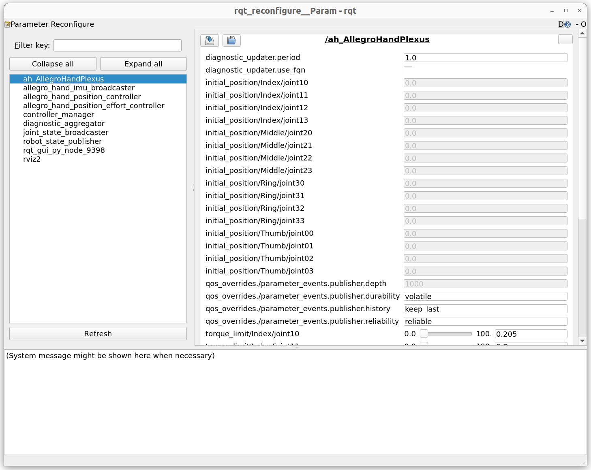
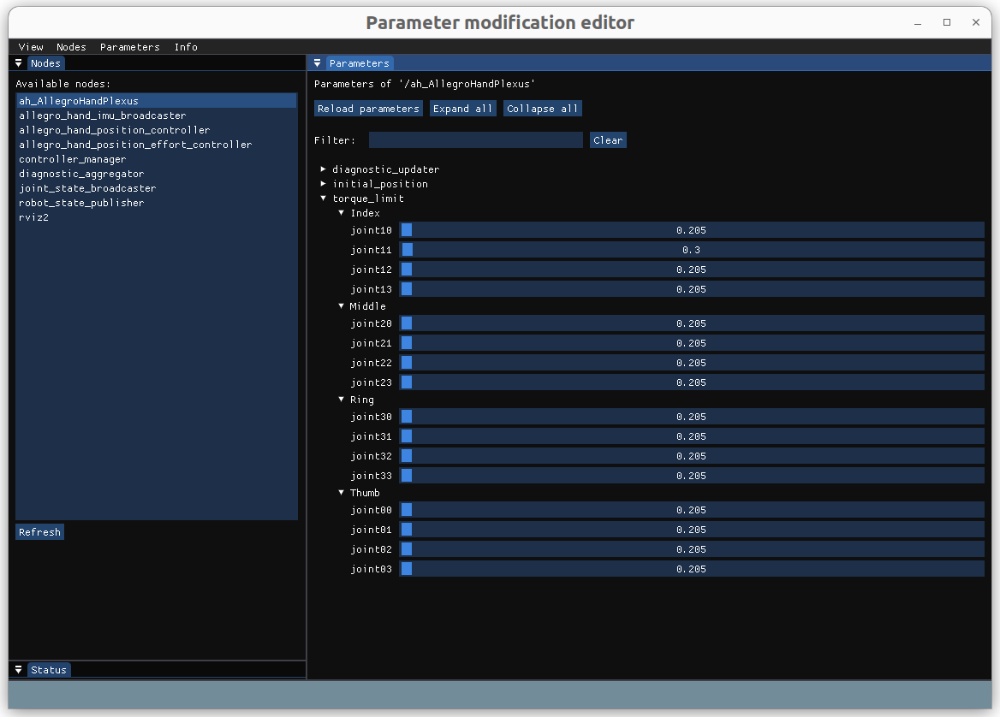

# allegro_hand_plexus_hardware

The `allegro_hand_plexus_hardware` package provides a `ros2_control` hardware interface for the Allegro Hand Plexus.
This package functions as a hardware interface plugin (`hardware_interface::SystemInterface`) for the `ros2_control` framework. It acts as a bridge, enabling ROS 2 controllers to communicate with the physical Allegro Hand Plexus hardware. It is designed to expose both position and effort command interfaces, making it suitable for hybrid control strategies.

---
## 1. Key Features

* **`ros2_control` Integration**: Integrates with the `ros2_control` framework, loaded and managed via the `controller_manager`.
* **State Interfaces**: Exports `position`, `velocity`, and `effort` states for each joint.
* **Command Interfaces**: Exports both `position` and `effort` command interfaces, allowing for versatile control methods like the `position_effort_controller`.
* **Diagnostic Information Publishing**: Uses `diagnostic_updater` to periodically publish hardware status, including communication and motor status, to the `/diagnostics` topic.

---
## 2. Joint Name Definitions

The Allegro Hand Plexus consists of a total of 16 joints, with 4 joints assigned to each finger. The joint names used in the SDK and URDF follow a set convention.

| Finger | Joint 0 (Base) | Joint 1 (Proximal) | Joint 2 (Medial) | Joint 3 (Distal) |
| :--- | :--- | :--- | :--- | :--- |
| **Thumb** | `joint00` | `joint01` | `joint02` | `joint03` |
| **Index** | `joint10` | `joint11` | `joint12` | `joint13` |
| **Middle** | `joint20` | `joint21` | `joint22` | `joint23` |
| **Ring** | `joint30` | `joint31` | `joint32` | `joint33` |

When setting up the URDF, adding the `device_prefix` parameter will prepend the specified prefix to all joint names (e.g., `left_joint00`).

---
## 3. Plugin Parameters

The `allegro_hand_plexus_hardware::PlexusHardwareInterface` class can be configured through the following parameters in the `<hardware>` section within the `<ros2_control>` tag of a URDF file.

```xml
<ros2_control name="AllegroHandPlexus" type="system">
    <hardware>
        <plugin>allegro_hand_plexus_hardware/PlexusHardwareInterface</plugin>
        <param name="io_interface_descriptor">can0</param>
        <param name="device_prefix">ah_</param>
    </hardware>
    ...
</ros2_control>
```

* **`io_interface_descriptor`** (`string`, required)    
    * The name of the IO interface for communication with the Allegro Hand (e.g., `can:can0`).
* **`device_prefix`** (`string`, optional)    
    * A prefix to be added to all joint names of the hand. This is used to distinguish the joints of each hand in configurations like a dual-hand setup.

---
## 4. Dependencies

This package depends on the following packages:

* `ament_cmake`
* `rclcpp`
* `hardware_interface`
* `pluginlib`
* `rclcpp_lifecycle`
* `realtime_tools`
* `spdlog`
* `diagnostic_updater`
* `allegro_hand_io`

---
## 5. Build Instructions

You can build the package from the root of your workspace using Colcon.
```bash
colcon build --packages-select allegro_hand_plexus_hardware
```

---
## 6. Usage

This hardware interface is integrated similarly to other systems that use `ros2_control`.

### 6.1. URDF Configuration

You must add a `<ros2_control>` tag within your robot's URDF file and configure it to use this hardware interface plugin. The Plexus hardware supports both `position` and `effort` command interfaces.

```xml
<ros2_control name="AllegroHandPlexus" type="system">
    <hardware>
        <plugin>allegro_hand_plexus_hardware/PlexusHardwareInterface</plugin>
        <param name="io_interface_descriptor">can0</param>
    </hardware>
    <joint name="ah_joint00">
        <command_interface name="position"/>
        <command_interface name="effort"/>
        <state_interface name="position"/>
        <state_interface name="velocity"/>
        <state_interface name="effort"/>
    </joint>
    ...
</ros2_control>
```

### 6.2. Launching the Controller

Run a launch file that includes the `ros2_control_node` to load the hardware interface and controllers. The `position_effort_controller` is typically used with this hardware. Please refer to the README of the `allegro_hand_bringup` package for launch examples.

### 6.3. Checking Status

While the controller is running, you can use the following ROS 2 commands to check the main hardware statuses directly from the terminal.

#### Checking Joint States

The position, velocity, and effort of each joint are published to the `/joint_states` topic by the `joint_state_broadcaster`.

```bash
ros2 topic echo /joint_states
```

#### Checking Joint Temperatures

The temperature of each joint is published to the `/dynamic_joint_states` topic by the `joint_state_broadcaster`. You can check the real-time temperature values with the following command.

```bash
ros2 topic echo /dynamic_joint_states
```

#### Checking Diagnostic Messages

The hardware status is published to the `/diagnostics` topic. Using `rqt_robot_monitor` allows for convenient visual monitoring of the status.

```bash
# Check via GUI (recommended)
ros2 run rqt_robot_monitor rqt_robot_monitor

# Check directly in the terminal
ros2 topic echo /diagnostics
```


### 6.4. Parameters

This hardware interface supports real-time checking and dynamic tuning of the Allegro Hand's PD control gains and torque limits via the ROS 2 parameter server. This feature is handled by a separate node, independent of the control loop, so it does not affect real-time performance.

#### Parameters

This hardware interface provides the following four groups of parameters. Each parameter is named in the format `group/finger_name/sequence_joint_name`.


* **`torque_limit`**: **Maximum Torque Limit** for each joint
    * **Description**: This value limits the maximum torque that each joint can produce. It serves as a safety feature to protect the motors and prevent grasping objects too forcefully. (Unit: normalized torque value, 0.0 to 1.0)
    * **Example**: `2_torque_limit/Thumb/0_joint_p_00`

* **`initial_position`**: **Initial Position** for each joint
    * **Description**: This is the initial position (pose) that each joint will assume when the controller is activated. This value can be set within the joint's position limits defined in the URDF.
    * **Example**: `3_initial_position/Thumb/0_joint_p_00`


#### Checking Parameters

The hand's parameters are managed through the `/ah_AllegroHandPlexus` node.

First, you can list all configurable parameters using the `ros2 param list` command.

```bash
ros2 param list /ah_AllegroHandPlexus
```

To check the gain value of a specific joint, use the `ros2 param get` command.

```bash
# Example: Check the torque limit of the thumb's first joint ('joint00')
ros2 param get /ah_AllegroHandPlexus torque_limit/Thumb/joint00
```

#### Updating Parameters

You can change a specific parameter value in real-time using the `ros2 param set` command. The changed value is immediately applied to the hardware.

```bash
# Example: Set the torque limit of the 'joint00' joint to 0.2
ros2 param set /ah_AllegroHandPlexus torque_limit/Thumb/joint00 0.2
```

Using a GUI tool like `rqt_reconfigure` allows for more intuitive parameter tuning.

```bash
ros2 run rqt_reconfigure rqt_reconfigure
```




#### rig_reconfigure

We recommend using `rig_reconfigure`, which provides a more user-friendly UI than `rqt_reconfigure`. As `rig_reconfigure` is not a default ROS 2 package, you need to build it from the source code.

```bash
# Clone the source code
cd ~/your_ros2_ws/src
git clone --recursive https://github.com/teamspatzenhirn/rig_reconfigure.git
```

```bash
# Build the package with `colcon`
cd ~/your_ros2_ws
colcon build --packages-select rig_reconfigure
```

```bash
# Run
ros2 run rig_reconfigure rig_reconfigure
```

Once the GUI is running, you can select the `/ah_AllegroHandPlexus` node from the dropdown menu at the top to check and modify parameters in real-time.



#### Saving Parameters
The parameters tuned in real-time are only applied to the ROS 2 parameter server. To save these values permanently, you must 'dump' the current parameter values into a YAML file. The `ros2 param dump` command allows you to save all parameters of a specific node to a file.

```bash
# Example: Save all parameters of the /ah_AllegroHandPlexus node to a my_gains.yaml file
ros2 param dump /ah_AllegroHandPlexus --output-dir ./config
```

Executing the above command will create a `ah_AllegroHandPlexus.yaml` file in the `config` folder under the current directory. 